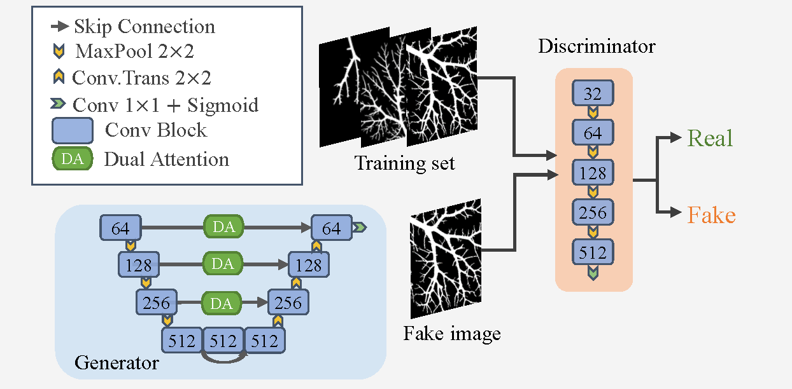

# DAU-GAN
This is the keras implementation of the paper.

We designed a generative adversarial network to segment drug-contained vessels, wherein the generator incorporated an dual-attention module into the commonly-employed segmentation network U-Net.
More details can be found in this paper.
```
X. Wang, X. Liu, L. Lin, Q. Guo and X. Tang, "Generative Adversarial Training with Dual-Attention for Vascular Segmentation and Topological Analysis," 2021 43rd Annual International Conference of the IEEE Engineering in Medicine & Biology Society (EMBC), 2021, pp. 2798-2801, doi: 10.1109/EMBC46164.2021.9629656.
```
## Usage

### Environment
```
pip install -r requirements.txt
```

### Dataset augmentation

```
python preProcess.py
```

### Model training
- training the DAU-GAN in the augmented dataset
```
nohup python -u GAN.py --ratio_gan2seg=10 --gpu_index=3 --batch_size=1 --lr=1e-4 --imageSize=720 --dataset=liver720_1 --withAugment > bce_1e-4.log 2>&1 & 
```

- training the DAU-GAN in the dataset without augmentation
```
python -u GAN.py --ratio_gan2seg=10 --gpu_index=3 --batch_size=1 --lr=1e-4 --imageSize=720 --dataset=liver720_1
```